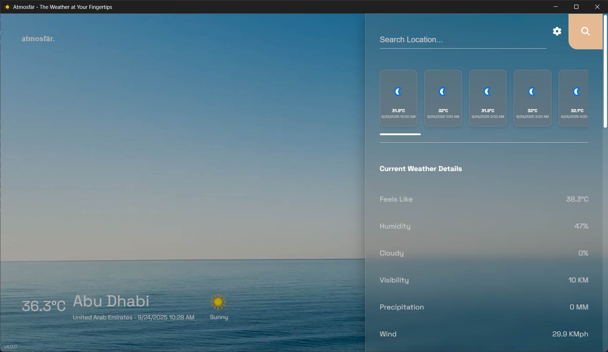

# Changelog

All notable changes to Atmosfär will be documented in this file.

The format is based on [Keep a Changelog](https://keepachangelog.com/en/1.0.0/),
and this project adheres to [Semantic Versioning](https://semver.org/spec/v2.0.0.html).

---

## [4.2.2] - 2025-09-30

### 🎨 Visual Improvements
- Enhanced download button with Windows and Linux (Coming Soon) platform icons
- Wider weather boxes (30% increase) for better text readability
- High-quality 128x128 weather icons from WeatherAPI CDN
- Improved mobile responsiveness with larger weather boxes

### 🌤️ Weather Features
- Hourly forecast now shows next 24 hours from current time (not past hours)
- Sharper, always up-to-date weather icons
- Better readability for long weather conditions like "PATCHY RAIN NEARBY"

### 📱 Cross-Platform Support
- Clear platform support indication with Windows and Linux icons
- Better mobile experience with improved sizing
- Professional hover effects and spacing

### ⚡ Performance
- Faster icon loading via global CDN
- More relevant forecast data for better weather planning
- Enhanced design consistency throughout the app

---

## [4.2.1] - 2025-09-29

### 🕐 Time Display Fixes
- Fixed unwanted date showing in 24-hour mode
- Both 12-hour (1:00 PM) and 24-hour (13:00) modes now show only time
- Consistent time format across web and desktop versions

### 🎨 Dark Mode Improvements
- Enhanced dark mode color scheme throughout the app
- Fixed jarring white search button hover in dark mode
- Better search input styling with proper accent colors
- Improved visual consistency across all dark mode elements

### 🎯 User Experience
- Improved button styling and link appearance
- Cleaner, more organized interface
- Enhanced visual hierarchy

---

## [4.2.0] - 2025-09-29

### 📸 Before & After

  <table>
    <tr>
      <td align="center"><strong>Before (v4.0.x)</strong></td>
      <td align="center"><strong>After (v4.2.0)</strong></td>
    </tr>
    <tr>
      <td></td>
      <td></td>
    </tr>
  </table>

### ✨ Added
- Modern glassmorphism design throughout the app
- New weather data: Windchill, Heat Index, and Dew Point
- Web installer and offline installer options
- Enhanced loading screen with improved animation

### 🔄 Changed
- Redesigned weather display with cleaner, compact layout
- Search now only triggers on button click or Enter key
- Removed automatic search while typing for better performance
- Polished weather cards and hourly forecast styling

### 🐛 Fixed
- Loading screen positioning issues
- Weather display layout problems
- Improved app stability and reliability
- Better responsiveness across devices

---

## [4.0.1] - 2025-09-25

### ✨ Added
- Dark mode support with theme switcher
- Wind direction arrows and moon phase icons
- Redesigned settings modal

### 🔄 Changed
- Stylized "Atmosfär" wordmark header
- Improved weather visuals and layout
- Enhanced external link handling

### � Fixed
- Better performance with cached weather data
- Streamlined update indicators

---

## [4.0.0] - 2025-09-25

### 🎉 Added
- Initial release of Atmosfär weather application
- Real-time weather information display
- Clean and intuitive user interface
- Native desktop experience powered by ElectronJS
- Windows platform support

### 📋 Notes
- First stable release
- Windows only compatibility