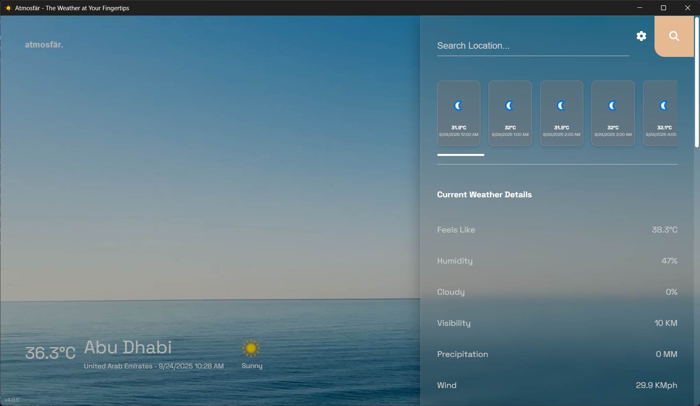

<div align="center">
  
  
  # Atmosfär
  
  **The Weather at Your Fingertips** 🌤️
  
  
</div>

## About

Atmosfär is a sleek weather application built with modern web technologies (HTML, CSS & JavaScript) and powered by ElectronJS for a native desktop experience.

🖥️ **Available for Windows and Linux**

## Features

- 🌡️ Real-time weather information
- 🎨 Clean and intuitive interface
- ⚡ Fast and lightweight
- 🖥️ Native desktop experience

## Download

📥 **[Download Latest Release](https://github.com/SahalMoh/AtmosfarReleases/releases/latest)**

📋 **[View Changelog](./CHANGELOG.md)**

<!--### Linux Package Managers

**Flatpak:**
```bash
flatpak install sahal.atmosfar.desktop
```
-->
---

<div align="center">
  <sub>This repository is used for distributing installer and binaries of the Atmosfär application.</sub>
</div>